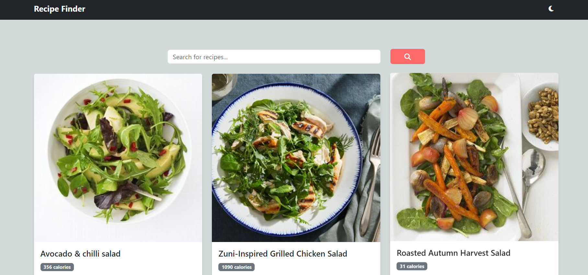
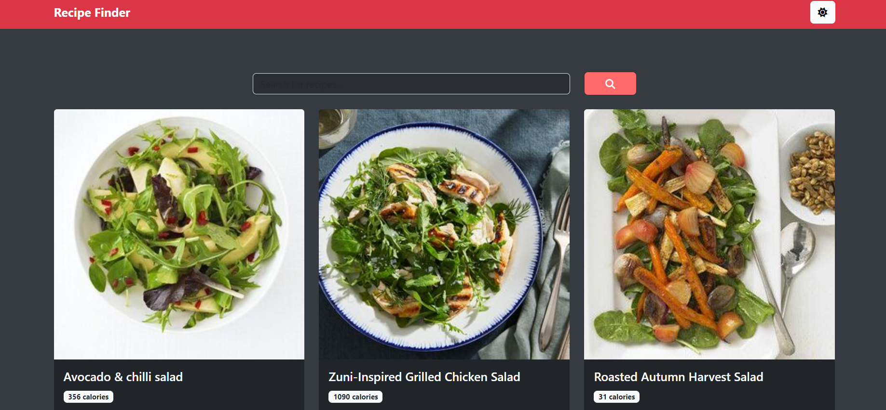

# Recipe Finder

Recipe Finder is a React-based web application that allows users to search for recipes using the Edamam API. It features a responsive design, dark/light theme toggle, and displays recipe cards with ingredients and calorie information.

## Table of Contents

- [Features](#features)
- [Demo](#demo)
- [Getting Started](#getting-started)
  - [Prerequisites](#prerequisites)
  - [Installation](#installation)
- [Usage](#usage)
- [Environment Variables](#environment-variables)
- [Deployment](#deployment)
- [Contributing](#contributing)
- [License](#license)
- [Acknowledgements](#acknowledgements)

## Features

- Search for recipes by keywords
- Display recipe cards with image, title, calories, and ingredients
- Responsive design using React Bootstrap
- Dark/Light theme toggle
- Loading and error states

## Demo

[View the live demo](https://recipe-finder-dusky-nine.vercel.app/)


## Screenshots
 <br>

 <br>

## Getting Started

Follow these instructions to set up the project locally.

### Prerequisites

- Node.js (v14 or later)
- npm (v6 or later)

### Installation

1. Clone the repository:
   ```
   git clone https://github.com/aviacharya1/recipe-finder.git
   ```

2. Navigate to the project directory:
   ```
   cd recipe-finder
   ```

3. Install dependencies:
   ```
   npm install
   ```

4. Create a `.env` file in the root directory and add your Edamam API credentials:
   ```
   VITE_APP_ID=your_app_id
   VITE_APP_KEY=your_app_key
   ```

5. Start the development server:
   ```
   npm run dev
   ```

6. Open your browser and visit `http://localhost:5173` to view the app.

## Usage

1. Enter a recipe or ingredient in the search bar.
2. Press the search button or hit Enter.
3. Browse through the recipe cards displayed.
4. Toggle between dark and light themes using the theme switcher in the navbar.

## Environment Variables

This project uses the following environment variables:

- `VITE_APP_ID`: Your Edamam API App ID
- `VITE_APP_KEY`: Your Edamam API App Key

Make sure to add these to your `.env` file and to configure them in your Vercel deployment settings.

## Deployment

This project is set up for easy deployment on Vercel. To deploy your own instance:

1. Fork this repository.
2. Sign up for a [Vercel account](https://vercel.com/signup) if you haven't already.
3. Create a new project on Vercel and link it to your forked repository.
4. Configure the environment variables (`VITE_APP_ID` and `VITE_APP_KEY`) in your Vercel project settings.
5. Deploy the project.

Vercel will automatically build and deploy your app whenever you push changes to your repository.

## Contributing

Contributions are welcome! Please follow these steps to contribute:

1. Fork the repository.
2. Create a new branch: `git checkout -b feature/your-feature-name`.
3. Make your changes and commit them: `git commit -m 'Add some feature'`.
4. Push to the branch: `git push origin feature/your-feature-name`.
5. Submit a pull request.

Please make sure to update tests as appropriate and adhere to the existing coding style.

## License

This project is licensed under the MIT License - see the [LICENSE](LICENSE) file for details.

## Acknowledgements

- [React](https://reactjs.org/)
- [Vite](https://vitejs.dev/)
- [React Bootstrap](https://react-bootstrap.github.io/)
- [Edamam API](https://developer.edamam.com/edamam-recipe-api)
- [Font Awesome](https://fontawesome.com/)
